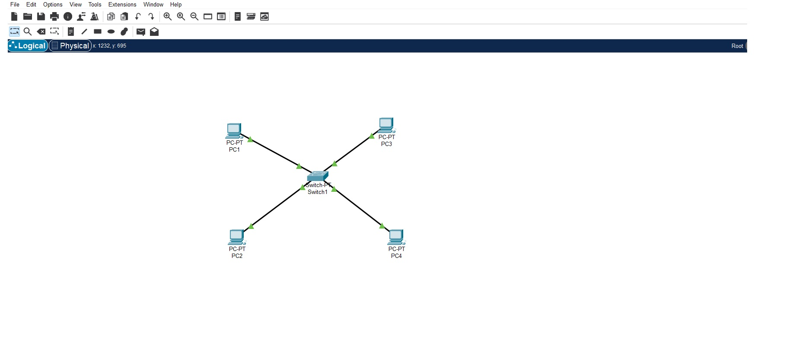
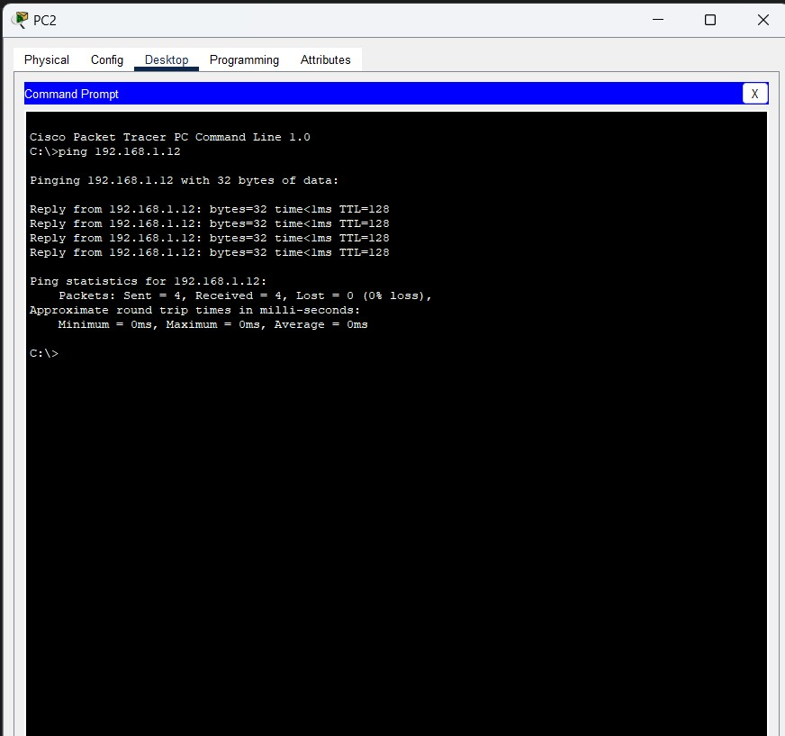

# Arquitetura Estrela com 4 Computadores e um Switch

## Descrição da Arquitetura
A rede foi configurada utilizando a topologia **estrela**, na qual os dispositivos estão conectados a um switch central por cabos Ethernet. Essa arquitetura oferece simplicidade e facilidade de manutenção, além de permitir que cada dispositivo se comunique com os outros por meio do switch.

### Componentes da Rede
- **Switch**: Dispositivo central que gerencia o tráfego de dados entre os computadores.
- **Computadores**: 
  - **PC1**: Endereço IP 192.168.1.10
  - **PC2**: Endereço IP 192.168.1.11
  - **PC3**: Endereço IP 192.168.1.12
  - **PC4**: Endereço IP 192.168.1.13
- **Cabos Ethernet**: Conectam os PCs ao switch.

### Configuração de Rede
Cada computador recebeu um endereço IP na mesma sub-rede, garantindo que eles possam se comunicar diretamente:
- **Máscara de Sub-rede**: 255.255.255.0
- **Gateway**: Não utilizado, pois a comunicação é  local.

### Teste de Conectividade
Foi realizado um teste de conectividade utilizando o comando `ping` do **PC1** (192.168.1.10) para o **PC3** (192.168.1.12).

#### Comando Executado
```bash
ping 192.168.1.12
```


## Imagem arquitetura estrela 



## Imagem Ping com sucesso




